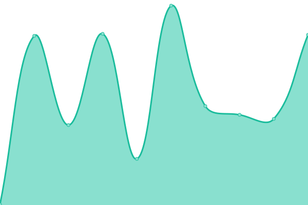
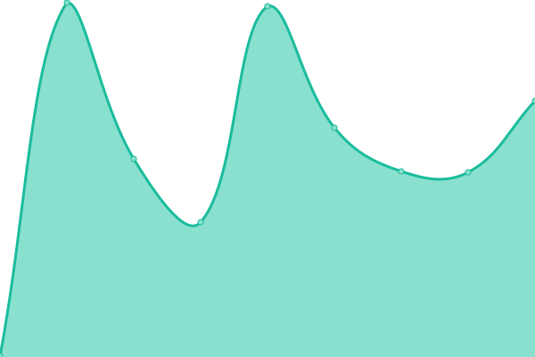
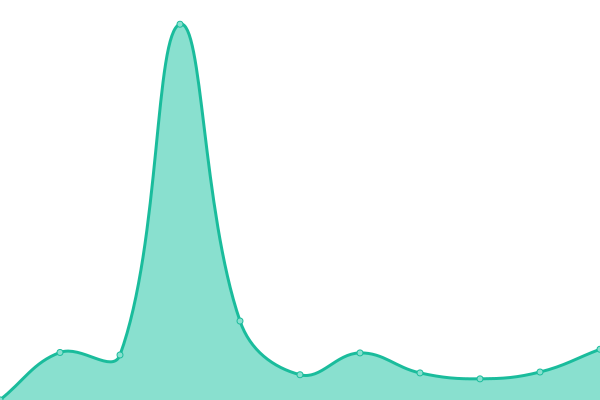
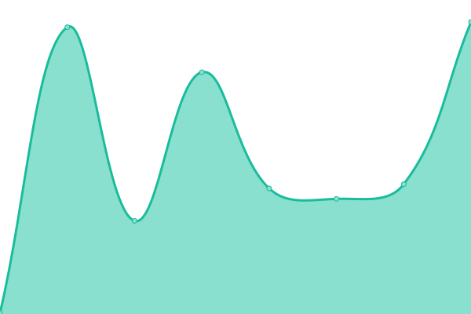

# [📈 Live Status](https://cns-iu.github.io/upptime): <!--live status--> **🟩 All systems operational**

This repository contains the open-source uptime monitor and status page for [Cyberinfrastructure for Network Science Center at Indiana University](cns.iu.edu), powered by [Upptime](https://github.com/upptime/upptime).

With [Upptime](https://upptime.js.org), you can get your own unlimited and free uptime monitor and status page, powered entirely by a GitHub repository. We use [Issues](https://github.com/cns-iu/upptime/issues) as incident reports, [Actions](https://github.com/cns-iu/upptime/actions) as uptime monitors, and [Pages](https://cns-iu.github.io/upptime) for the status page.

<!--start: status pages-->
<!-- This summary is generated by Upptime (https://github.com/upptime/upptime) -->
<!-- Do not edit this manually, your changes will be overwritten -->
<!-- prettier-ignore -->
| URL | Status | History | Response Time | Uptime |
| --- | ------ | ------- | ------------- | ------ |
|  [CNS Website](https://cns.iu.edu) | 🟩 Up | [cns-website.yml](https://github.com/cns-iu/upptime/commits/HEAD/history/cns-website.yml) | 

 231ms
     
 | 

<a href="https://cns-iu.github.io/upptime/history/cns-website">99.89%</a>
    

|  [Scimaps.org](https://scimaps.org) | 🟩 Up | [scimaps-org.yml](https://github.com/cns-iu/upptime/commits/HEAD/history/scimaps-org.yml) | 

 306ms
     
 | 

<a href="https://cns-iu.github.io/upptime/history/scimaps-org">99.90%</a>
    

|  [visanalytics.cns.iu.edu](https://visanalytics.cns.iu.edu) | 🟩 Up | [visanalytics-cns-iu-edu.yml](https://github.com/cns-iu/upptime/commits/HEAD/history/visanalytics-cns-iu-edu.yml) | 

 262ms
     
 | 

<a href="https://cns-iu.github.io/upptime/history/visanalytics-cns-iu-edu">99.90%</a>
    

|  [HRA Portal](https://humanatlas.io) | 🟩 Up | [hra-portal.yml](https://github.com/cns-iu/upptime/commits/HEAD/history/hra-portal.yml) | 

 332ms
     
 | 

<a href="https://cns-iu.github.io/upptime/history/hra-portal">100.00%</a>
    

|  [HRA Apps](https://apps.humanatlas.io) | 🟩 Up | [hra-apps.yml](https://github.com/cns-iu/upptime/commits/HEAD/history/hra-apps.yml) | 

 366ms
     
 | 

<a href="https://cns-iu.github.io/upptime/history/hra-apps">100.00%</a>
    

|  [HRA API](https://apps.humanatlas.io/api/) | 🟩 Up | [hra-api.yml](https://github.com/cns-iu/upptime/commits/HEAD/history/hra-api.yml) | 

 139ms
     
 | 

<a href="https://cns-iu.github.io/upptime/history/hra-api">100.00%</a>
    

<!--end: status pages-->

[**Visit our status website →**](https://cns-iu.github.io/upptime)

## 📄 License

- Powered by: [Upptime](https://github.com/upptime/upptime)
- Code: [MIT](./LICENSE) © [Anand Chowdhary](https://anandchowdhary.com), supported by [Pabio](https://pabio.com)
- Data in the `./history` directory: [Open Database License](https://opendatacommons.org/licenses/odbl/1-0/)
